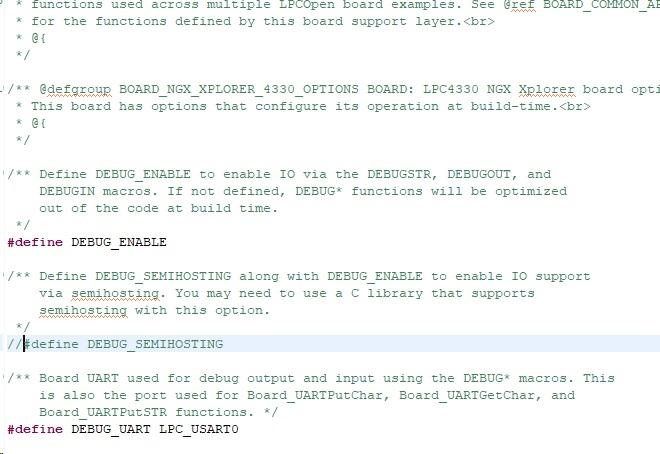
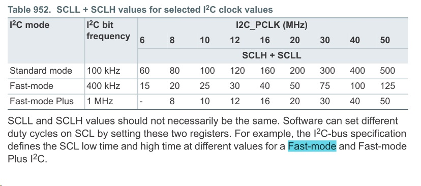

# NXP 1837

## Requires ISP mode
    * Flash Magic(windows)
    * lpc21isp(Linux)

## GDB Console

### DEBUG_SEMIHOSTING

* need modify board.h
    
    - DEBUG_SEMIHOSTING or DEBUG_UART LPC_USART0 annotation Cancel, you can check the log internally




### DEBUG UART

* Need to modify the pin of board.c uart0

* DEBUG_SEMIHOSTING annotation in board.h



* The default uart0 tx pin needs to be modified

```
void Board_UART_Init(LPC_USART_T *pUART)
{
	//Chip_SCU_PinMuxSet(0x6, 4, (SCU_MODE_INACT | SCU_MODE_FUNC2));					/* P6,4 : UART0_TXD */
	Chip_SCU_PinMuxSet(0x2, 0, (SCU_MODE_INACT | SCU_MODE_INBUFF_EN | SCU_MODE_ZIF_DIS | SCU_MODE_FUNC1));/* P2.0 : UART0_TXD */
	Chip_SCU_PinMuxSet(0x2, 1, (SCU_MODE_INACT | SCU_MODE_INBUFF_EN | SCU_MODE_ZIF_DIS | SCU_MODE_FUNC1));/* P2.1 : UART0_RXD */
}
```

## GPIO SETUP

* Chip_SCU_PinMuxSet
* Chip_GPIO_SetPinState
* Chip_GPIO_SetPortDIROutput
* Chip_GPIO_SetPortDIRInput

### read GPIO
* Chip_GPIO_GetPinState
* Chip_GPIO_ReadPortBit
* Chip_GPIO_ReadValue

## I2C Fast-modo

* 一開始的I2C bus 操作的速度被限制在100kbit/s，不過隨著時代的演進，新增了一些模式，所以現在的規範分成五種操作速度:

* 雙向
    * 標準模式 (Standard-mode), 速率可高達 100 kbit/s
    * 快速模式 (Fast-mode), 速率可高達 400 kbit/s
    * 快速模式PLUS (Fast-mode Plus), 速率可高達 1 Mbit/s
    * 高速模式 (High-speed mode), 速率可高達 3.4 Mbit/s.

* 單向
    * 超快速模式(Ultra Fast-mode), 速率可高達 5 Mbit/s
    * 快速模式的設備可以在400kbit/s 下做接收和傳送。並且向下相容，可以和標準模式的設備在0~100kbit/s 的I2C bus 通訊。快速模式與標準模式的比較如下:
    * 最大速率增加到400kbit/s
    * 調整 序列資料SDA 和 序列時脈SCL的時序
    * 快速模式設備的輸入有 spike suppression的功能，SDA和SCL的輸入有Schmitt trigger
    * 快速模式設備的輸出Buffer 對SDA和SCL信號的下降緣有斜率控制功能
    * 如果快速模式設備的電源電壓被關閉，SDA和SCL的I/O pin 必須浮接，才不會阻塞BUS


```

#define SPEED_100KHZ         100000
#define SPEED_400KHZ         400000
#define SPEED_1MHZ_PLUS      1000000

```

* 
## CPAN Install

* sudo apt-get install libyaml-appconfig-perl

* sudo apt-get install build-essential

* sudo apt-get install libterm-readline-gnu-perl
```
su -

cpan

cpan> install Bundle::CPAN

cpan> install Device::SerialPort

cpan> reload cpan

cpan> exit
```
