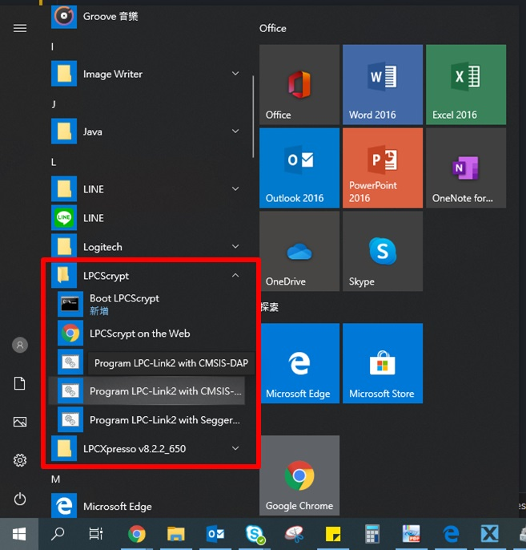
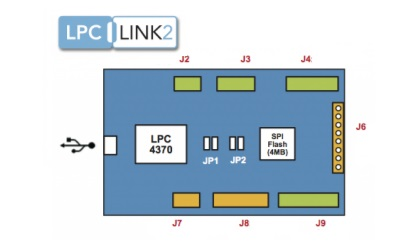
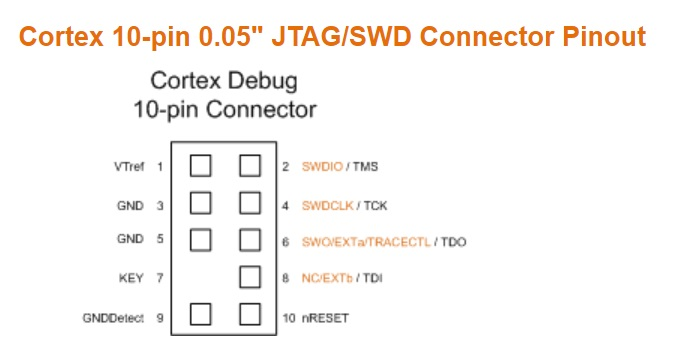
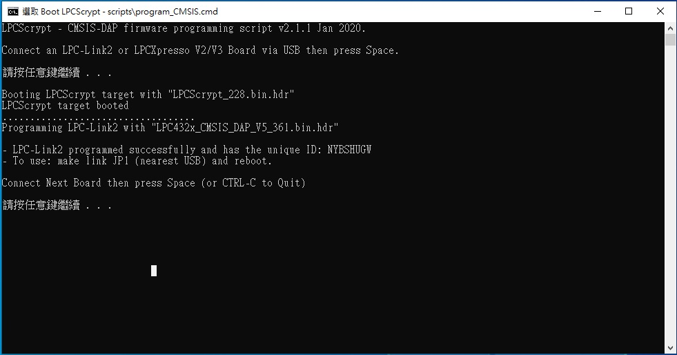
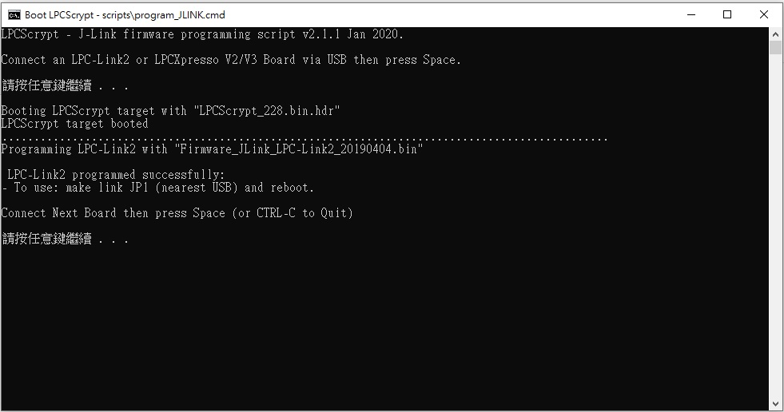
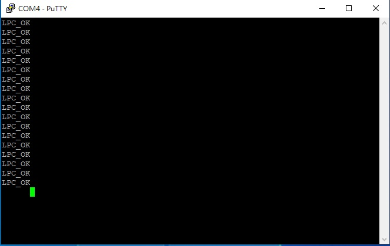

# LPCscript upgrade LPC-LINK2

## install  [LPCScrypt v2.1.1 J-LINK Downloads](https://www.nxp.com/design/microcontrollers-developer-resources/lpc-microcontroller-utilities/lpcscrypt-v2-1-1:LPCSCRYPT)
### Drive

* J-Link 
* CMSIS-DAP

* JP1 短路：從 USB DFU 啟動（如更新 LINK2 ）斷路：版上 SPI flash 啟動 
* JP2 短路：目标板由 LINK2 供电    斷路：目标板自供电 
* J2：板子上 LPC4370 是 JTAG J3/J4/J9:LINK2 版上對 LPC4370 的延伸接口（如可以連接 Lab tool 擴展板） 
* J6: LPCXpresso 板 JTAG 連接 
* J7：連接板子的 JTAG/SWD 
* J8：連接板子的 Trace 在使用 LPCScript 對 LPC-LINK2 更新之前，需要移除板子 JP1 的短路，然後使用 USB 線連接電腦。對於LPCXpresso V2/V3 板子，需要短路 DFU Link

## LPC_SMSIS_DAP

## JLINK-LPC

## LPC_SMSIS_DAP and JLINK-LPC

