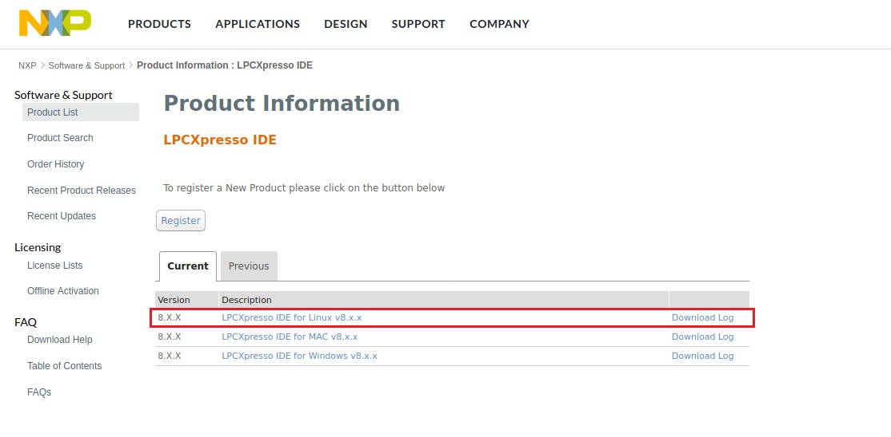
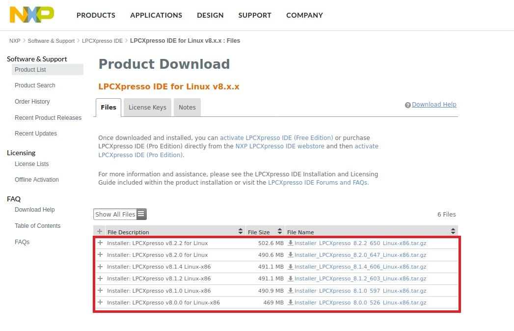

# Lpcxpress install

## Contents
- [Install IDE](#Install-IDE)
  - [IDE install linux](#for-linux)
- [Linux install LPCXpresso IDE](#Linux-install-LPCXpresso-IDE)
- [LPCXpresso datasheet](#LPCXpresso-datasheet)
---

# [Install IDE](https://www.nxp.com/)


 


# Linux install LPCXpresso IDE
## Host OS: Ubuntu 16.04 x86_64

* suo apt-get update

* sudo apt-get install gcc-arm-none-eabi

* sudo apt-get install lib32ncurses5

* sudo apt-get install libwebkitgtk-1.0-0

* sudo apt-get install libgtk2.0-0:i386 libpangox-1.0-0:i386 libpangoxft-1.0-0:i386 libidn11:i386 libglu1-mesa:i386 libxtst6:i386

* sudo apt-get install libpangoxft-1.0-0:i386 libidn11:i386 libglu1-mesa:i386 libncurses5:i386 libudev1:i386 libusb-1.0:i386 libusb-0.1:i386 gtk2-engines-murrine:i386 libnss3-1d:i386

* cd /lib/i386-linux-gnu

* sudo ln -sf libudev.so.1 libudev.so.0
 
* tar -xf Installer_LPCXpresso_8.0.0_526_Linux-x86.tar.gz

* tar -xf Installer_LPCXpresso_8.2.2_526_Linux-x86.tar.gz

* sudo ./Installer_LPCXpresso_8.0.0_526_Linux-x86  --mode console

* sudo ./Installer_LPCXpresso_8.2.2_650_Linux-x86  --mode console

* [Downloads lpc1837-3.0.3 SDK](https://www.nxp.com/design/microcontrollers-developer-resources/lpcopen-libraries-and-examples/lpcopen-software-development-platform-lpc18xx:LPCOPEN-SOFTWARE-FOR-LPC18XX)

* lpc.sh

```
#!/bin/bash

export PATH="/usr/local/lpcxpresso_8.2.2_650/ide:$PATH"

SWT_GTK3=0 /usr/local/lpcxpresso_8.2.2_650/lpcxpresso/lpcxpresso

export PATH="/usr/local/lpcxpresso_8.0.0_526/ide:$PATH"

SWT_GTK3=0 /usr/local/lpcxpresso_8.0.0_526/lpcxpresso/lpcxpresso

```


## LPCXpresso datasheet

* [LPCXPRESSO: LPCXpresso IDE v8.2.2](https://www.nxp.com/design/microcontrollers-developer-resources/lpc-microcontroller-utilities/lpcxpresso-ide-v8-2-2:LPCXPRESSO)

* [LPCXpresso IDE User Guide](https://www.nxp.com/docs/en/user-guide/LPCXpresso_IDE_User_Guide.pdf)


* [LPCXpresso Boards](https://www.nxp.com/design/development-boards/lpcxpresso-boards:LPCXPRESSO-BOARDS)

* [LPCXpresso IDE Installation and Licensing Guide](https://www.nxp.com/docs/en/user-guide/LPCXpresso_IDE_Installation_Guide.pdf)

* [Installing LPCXpresso on Linux](https://community.nxp.com/thread/389036)

* [LPCXpresso IDE SWO Trace Guide](https://www.nxp.com/docs/en/user-guide/LPCXpresso_IDE_SWO_Trace.pdf)

* [LPCScrypt v2.1.1 J-LINK Downloads](https://www.nxp.com/design/microcontrollers-developer-resources/lpc-microcontroller-utilities/lpcscrypt-v2-1-1:LPCSCRYPT)

* [Design Considerations for Debug](https://community.nxp.com/thread/388998)
