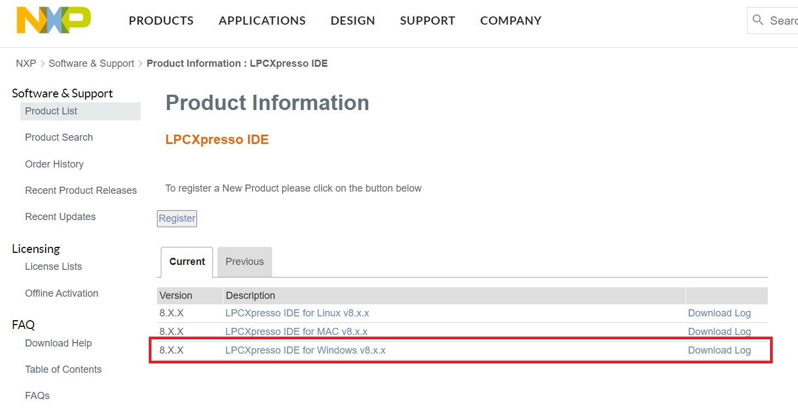
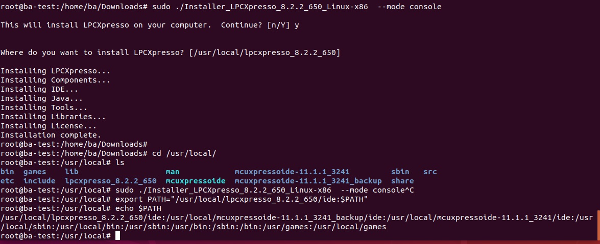

# Lpcxpress install

## Contents
- [Install IDE](#Install-IDE)
  - [IDE install linux](#for-linux)
---

# [Install IDE](https://www.nxp.com/)


 


### Linux install LPCXpresso IDE

* [到官網註冊帳號，才可以下載 IDE](https://www.nxp.com/)


* suo apt-get update

* sudo apt-get install gcc-arm-none-eabi

* sudo apt-get install lib32ncurses5

* sudo apt-get install libwebkitgtk-1.0-0

* sudo apt-get install libgtk2.0-0:i386 libpangox-1.0-0:i386 libpangoxft-1.0-0:i386 libidn11:i386 libglu1-mesa:i386 libxtst6:i386

* cd /lib/i386-linux-gnu

* sudo ln -sf libudev.so.1 libudev.so.0
 
* tar -xf Installer_LPCXpresso_8.0.0_526_Linux-x86.tar.gz

* tar -xf Installer_LPCXpresso_8.2.2_526_Linux-x86.tar.gz

* sudo ./Installer_LPCXpresso_8.0.0_526_Linux-x86  --mode console

* sudo ./Installer_LPCXpresso_8.2.2_650_Linux-x86  --mode console

* [Downloads lpc1837-3.0.3 SDK](https://www.nxp.com/design/microcontrollers-developer-resources/lpcopen-libraries-and-examples/lpcopen-software-development-platform-lpc18xx:LPCOPEN-SOFTWARE-FOR-LPC18XX)

* lpc.sh

```
#!/bin/bash

export PATH="/usr/local/lpcxpresso_8.2.2_650/ide:$PATH"

SWT_GTK3=0 /usr/local/lpcxpresso_8.2.2_650/lpcxpresso/lpcxpresso

export PATH="/usr/local/lpcxpresso_8.0.0_526/ide:$PATH"

SWT_GTK3=0 /usr/local/lpcxpresso_8.0.0_526/lpcxpresso/lpcxpresso

```


