# Lpcxpress install

## Contents
- [Install IDE](#Install-IDE)
  - [IDE install windows](#IDE-install-windows)
  - [start up key](#start-up-key)
  - [Copy key](#Copy-key)
  - [Login account NXP.COM](#Login-account-NXP.COM)
  - [Paste the KEY, and paste the KEY returned by the system to the IDE](#Paste-the-KEY-and-paste-the-KEY-returned-by-the-system-to-the-IDE)
  - [The following screen is displayed, the key activation is successful](#The-following-screen-is-displayed-the-key-activation-is-successful)
  - [install LPCScrypt v2.1.1 J-LINK Downloads](#install-LPCScrypt-v2.1.1-J-LINK-Downloads)
  - [J-LINK SWO](#J-LINK-SWO)
  - [IDE burn](#IDE-burn)
  - [IDE ERROR solution](#IDE-ERROR-solution)
  - [IDE ADD .bin .hex](#IDE-ADD-.bin-.hex)
---


# [Install IDE](https://www.nxp.com/)

## IDE install windows


 


## start up key

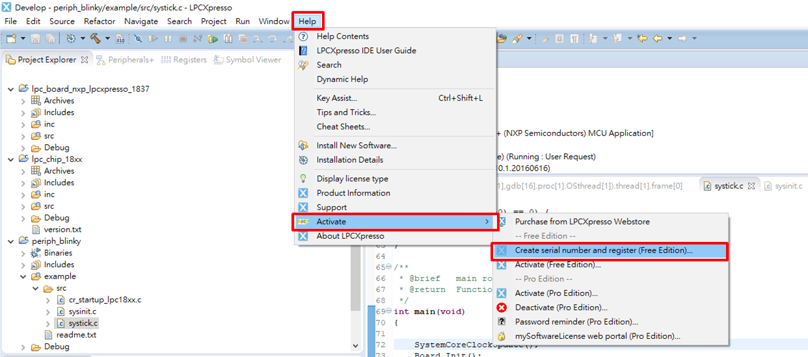

## Copy key

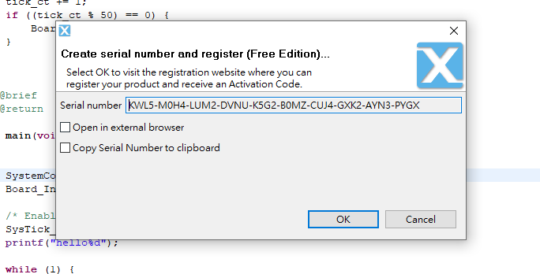

## Login account NXP.COM 

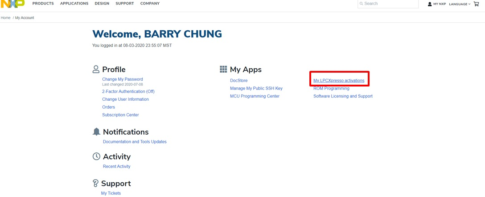

## Paste the KEY, and paste the KEY returned by the system to the IDE

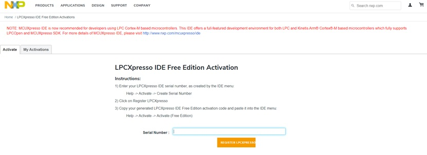

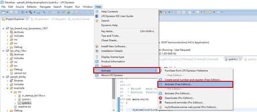

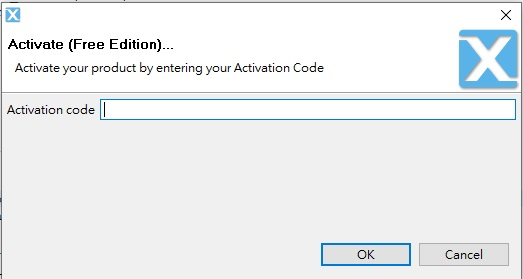

## The following screen is displayed, the key activation is successful

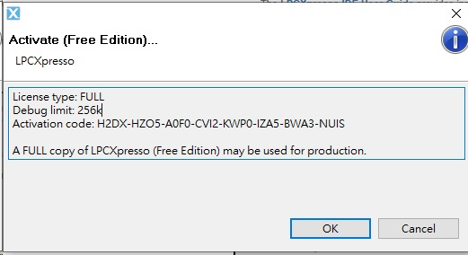

## J-LINK SWO 

* 如果使用J-LIMK驅動的話，Debugger改為JTAG

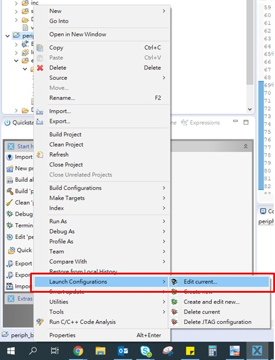

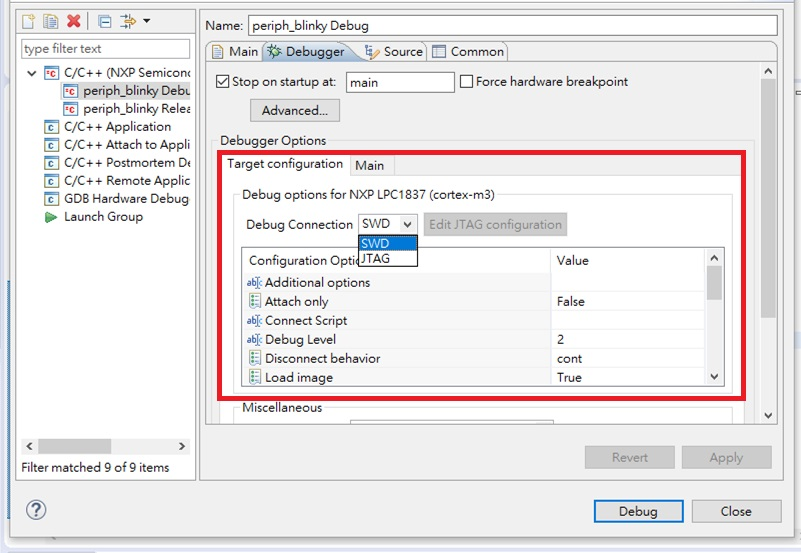

## IDE burn

1. build 
2. Debug
3. Only after the second step is passed LPC-LINK2 CMSIS-DAP


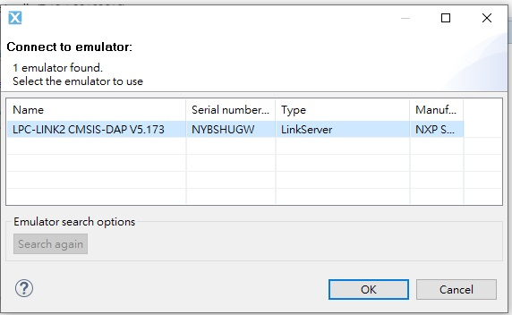

## IDE ERROR solution

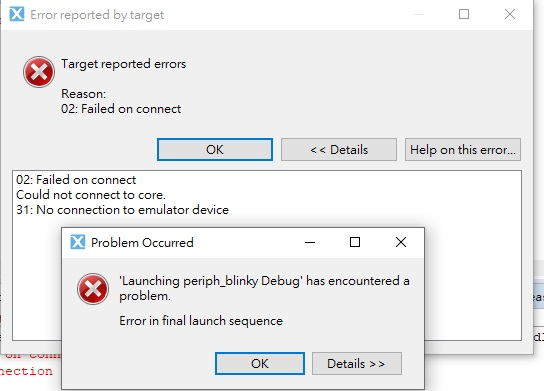

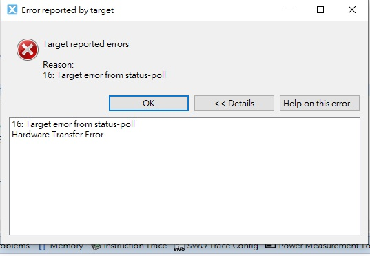

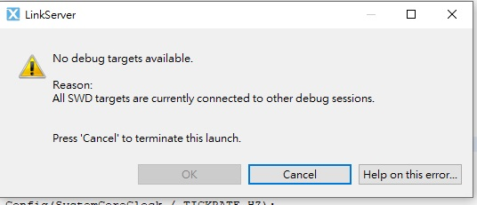

* solution
    * Unplug the LPC Link and reconnect to the computer

## [IDE ADD .bin .hex](https://mcuoneclipse.com/2017/03/29/mcuxpresso-ide-s-record-intel-hex-and-binary-files/)

```
arm-none-eabi-size "${BuildArtifactFileName}"
arm-none-eabi-objcopy -v -O ihex "${BuildArtifactFileName}" "${BuildArtifactFileBaseName}.hex"
arm-none-eabi-objcopy -v -O binary "${BuildArtifactFileName}" "${BuildArtifactFileBaseName}.bin"
# checksum -p ${TargetChip} -d "${BuildArtifactFileBaseName}.bin"
```


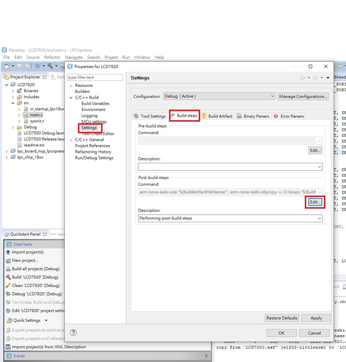

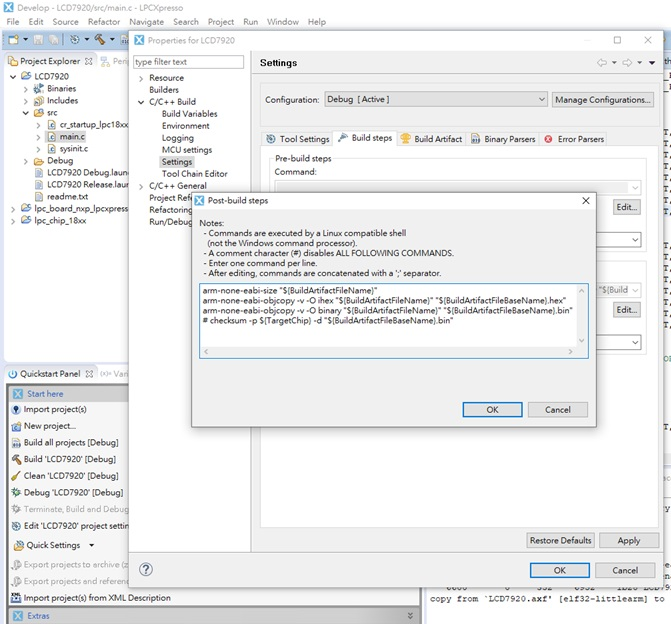
