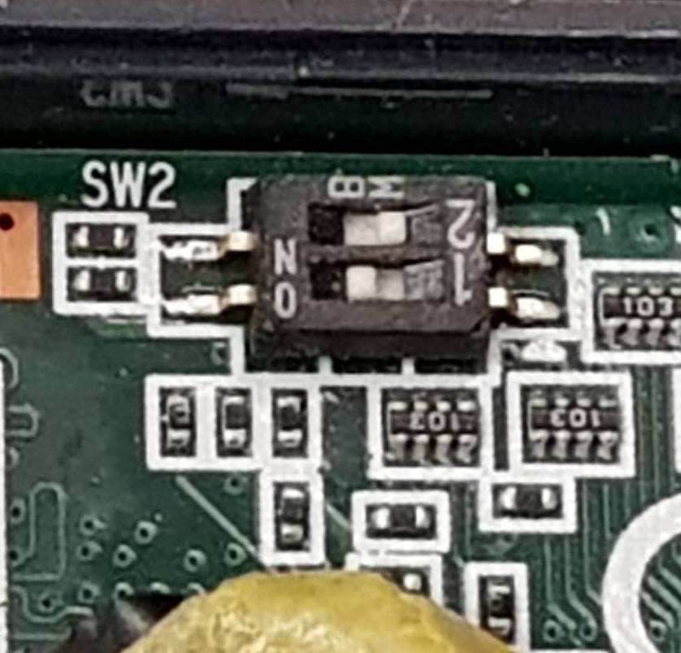

# WISE710A1 DDR3 2GB Ubuntu18.04

## Contents

- [Image Package](#image-package)
  - [Write Image to SD Card](#write-image-to-sD-card)

---

## Image Package

### Package: wise710a1_2g_ubuntu18044_20200804

### Tree of this package: 

```
wise710a1_2g_ubuntu18044_20200804
├── image
└── scripts
```

### Write Image to SD Card

#### Host OS: Ubuntu 16.04 x86_64

Insert SD Card into host PC and check which block device. 

```
$ lsblk
NAME   MAJ:MIN RM  SIZE RO TYPE MOUNTPOINT
sdb      8:16   0    2T  0 disk 
└─sdb1   8:17   0    2T  0 part /disk/workssd
sr0     11:0    1 1024M  0 rom  
sdc      8:32   1 14.4G  0 disk 
├─sdc2   8:34   1 14.4G  0 part 
└─sdc1   8:33   1   50M  0 part 
sda      8:0    0  512G  0 disk 
├─sda2   8:2    0    2G  0 part 
└─sda1   8:1    0  510G  0 part /
sr1     11:1    1 1024M  0 rom  
```

In this example case, the SD card block device is `sdc`. 

Then, enter the scripts sub-directory in this package. 

```
$ ls
image  scripts
$ cd scripts
```

Run the write image script with SD card block device.

```
$ ./mksd_recovery-linux.sh /dev/sdc ubuntu18044
```

Follow the prompt to write image to SD card. 

```
All data on /dev/sdc now will be destroyed! Continue? [y/n]
```

Enter `y`, and wait for process done. 

#### Process prompt: 
```
partition start
DISK SIZE - 15502147584 bytes
partition done
partition done
mkfs.fat 3.0.28 (2015-05-16)
mkfs.fat: warning - lowercase labels might not work properly with DOS or Windows
mke2fs 1.42.13 (17-May-2015)
Creating filesystem with 3769344 4k blocks and 942848 inodes
Filesystem UUID: 28208437-5792-4f30-a6a1-1bed5d5edf7a
Superblock backups stored on blocks: 
        32768, 98304, 163840, 229376, 294912, 819200, 884736, 1605632, 2654208

Allocating group tables: done                            
Writing inode tables: done                            
Creating journal (32768 blocks): done
Writing superblocks and filesystem accounting information: 

dd [adv_boot & u-boot]
copy [zImage & dtb]
copy [rootfs]
[Copying iNAND upgrate tools...]
chown: cannot access 'mount_point0/home/advantech': No such file or directory
umount: /dev/sdc: not mounted
umount: /dev/sdc1: not mounted
```

After process done, eject the SD card and insert it into WISE-710A1 2GB DDR3 device. 

Make sure the `SW2` switch on device, 1: ON, 2: OFF. 

##### Fig: Switch SW2




